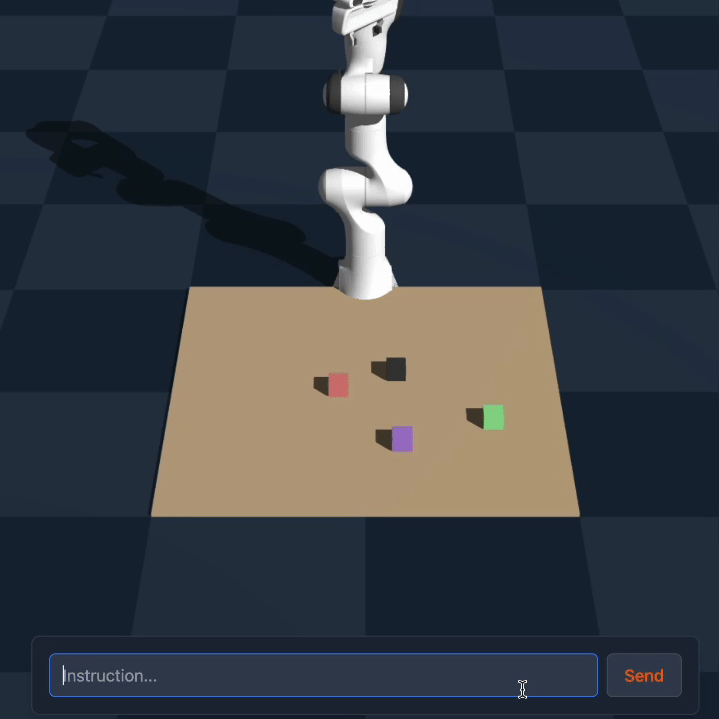

# 🌌 AlphaSpace: Spatial Intelligence with Tokens 

**Teaching language models to think in 3D**



## What is this?

AlphaSpace lets language models understand and manipulate objects in 3D space without needing eyes. 

Traditional robots need computer vision to see objects. We've created a different approach: structured tokens that encode spatial information, allowing language models to reason about position, orientation, and physical relationships between objects.

#### 🤔 How it Works:  A Token-Based Approach

AlphaSpace uses a hierarchical position-based token system:
1. **Global position tokens**: Represent a 25x25 grid (`<|row-col|>`, e.g., `<|5-10|>`)
2. **Local position tokens**: Provide 4x4 fine-grained positioning within each cell (`<|local-row-col|>`, e.g., `<|local-2-3|>`)
3. **Object attribute tokens**: Encode object properties (`<|color|><|object|>`, e.g., `<|red|><|cube|>`)
4. **State tokens**: Special indicators like `<|empty|>`, `<|origin|>`, and `<|target|>`

Our specialized training teaches models to manipulate these tokens to solve spatial problems.
#### 🔥 Why it matters

- **No cameras needed**: Pure language-based spatial reasoning
- **Precise manipulation**: Robots can position objects at exact coordinates
- **Natural instructions**: Tell robots what to do in plain language
- **Generalizes well**: Works with novel objects and spatial arrangements

## Get the code

- 📄 [Read the paper](https://arxiv.org/abs/2503.18769)
- 🤗 [Download the model](https://huggingface.co/homebrewltd/AlphaSpace-1.5B)
- 🧪 [Try the demo](https://alphaspace.demo.com)

## Try it yourself

```python
from transformers import AutoModelForCausalLM, AutoTokenizer, BitsAndBytesConfig, pipeline
import torch
from utils import tokenize_desk, SYSTEM_PROMPT

# Load the mode


model = AutoModelForCausalLM.from_pretrained(model_path, torch_dtype=torch.bfloat16).to(device)
tokenizer = AutoTokenizer.from_pretrained(model_path)

# Define your workspace
objects = [
    {"red-cube": [51, 43, 17]},
    {"black-cube": [44, 58, 17]},
    {"purple-cube": [74, 59, 17]},
    {"green-cube": [65, 82, 17]},
]

# Give a natural language instruction
instruction = "Throw the red cube on top of the blue cylinder"
desk, object_height = tokenize_desk(objects)
final_instruction = SYSTEM_PROMPT.format(object_height=object_height,instruction=instruction,TABLE_MAP=desk)
chat = [
    {"role": "user", "content": final_instruction.strip()}
]
tokenized_chat = tokenizer.apply_chat_template(chat, tokenize=True, add_generation_prompt=True, use_system_prompt=False, return_tensors="pt")
# print(len(tokenized_chat[0]))
generated_ids = model.generate(
    tokenized_chat.to("cuda"),
    max_new_tokens=2048,
    do_sample=False,
    temperature=0.6,
)
# Get the solution
result = tokenizer.decode(generated_ids[0][tokenized_chat.shape[1]:], skip_special_tokens=True)
print(result)
```

## Looking ahead

We're working on:
- Dynamic scene understanding
- Multi-step manipulation planning
- Physics-aware spatial reasoning

## Join us

We're looking for collaborators and plan to expand the model's capabilities to include additional spatial tasks in the future! Check out the [issues](https://github.com/menloresearch/space-thinker) to get started.

## References

```bibtex
@misc{dao2025alphamazeenhancinglargelanguage,
      title={AlphaMaze: Enhancing Large Language Models' Spatial Intelligence via GRPO}, 
      author={Alan Dao and Dinh Bach Vu},
      year={2025},
      eprint={2502.14669},
      archivePrefix={arXiv},
      primaryClass={cs.CL},
      url={https://arxiv.org/abs/2502.14669}, 
}
```

## Acknowledgement

- [llama-factory](https://github.com/hiyouga/LLaMA-Factory)
- [Deepseek](https://github.com/deepseek-ai/DeepSeek-R1)
---

*AlphaSpace was created by [Menlo Reseach](https://www.menlo.ai/). If you use it in your research, please cite our [paper](https://arxiv.org/abs/2503.18769).*